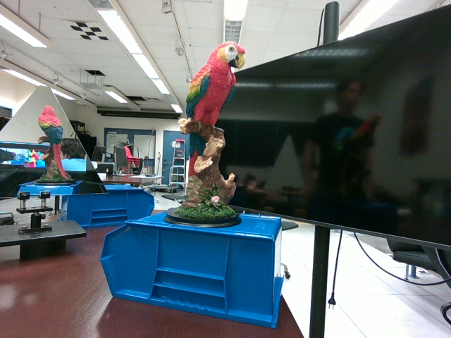
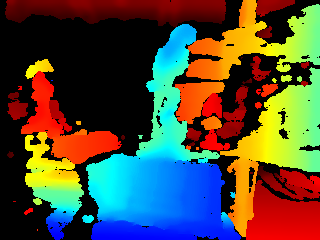
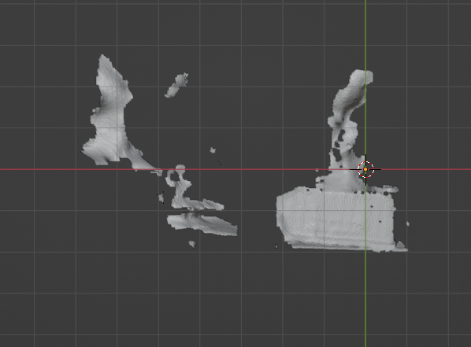
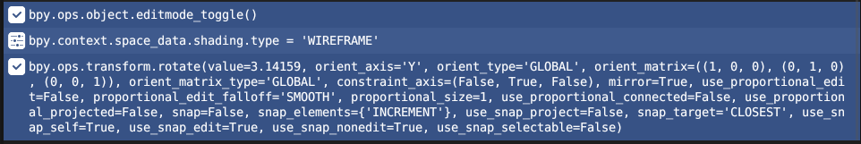

# CI Project - Better 3D reconstruction using stereo through mirrors

Computational Imaging Project

## Methodology

We use the Realsense and mirrors to try and get a better 3d reconstruction of object.

### 1. Get an rgb and depth image from the realsense

  <table style="margin: auto;">
    <tr>
      <td></td>
      <td></td>
    </tr>
  </table>

### 2. Load the mesh and segment out the object and reflection
We use blender for this step due to easy visualisation and python integration. A faster system might use opengl in cpp. We use the positions of the object and the mirror to determine the reflection's position. In code, we draw bounding volumes around each mesh and crop out two sub meshes for the object, and it's reflection.

  <table style="margin: auto;">
    <tr>
      <td></td>
      <td></td>
    </tr>
  </table>

### 3. Transform and merge reflection onto object
Since an object may have significant depth using a reflection transform to map the reflected mesh onto the position of the object mesh may not be correct. A simplifying assumption that we make is that if there are correspondences on both meshes, then logically these correspondences should be between the two closes vertices on each mesh. We therefore use blender commands to do these transforms instead of simply mirroring across the mirror plane.

Working in blender py is nice because you can rip commands from the blender terminal instead of doing matrix maths yourself! The code below does mesh rotation around a local origin. To get these commands, one simply does the manipulation in the blender gui and then gains inspiration from the command outputs.

  <table style="margin: auto;">
    <tr>
      <td></td>
    </tr>
  </table>

### 4. Map textures