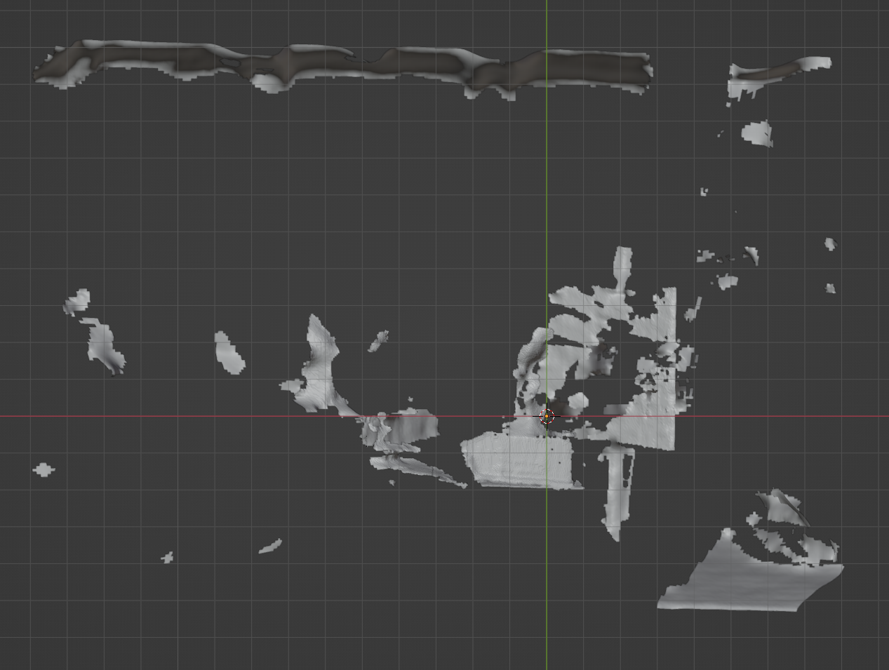

# Reflecstruction
## Computational Imaging Project - Better 3D reconstruction using stereo through mirrors

Nikolaus Holzer & Joel Salzman

## Methodology

We used a RealSense 455 and mirrors to produce a better 3D reconstruction of objects.
The project assignment was essentially to do something with the camera they gave us.

### 1. Get an RGB and depth image from the realsense

  <table style="margin: auto;">
    <tr>
      <td></td>
      <td></td>
    </tr>
  </table>

### 2. Load the mesh and segment out the object and reflection

We leverage SAM to find good image masks: one for the object and one for the reflection.
To do this effectively, we load the images into a GUI and prompt a user to select the object and its reflection in the mirror.
We also experimented with having them select the mirror itself if possible.

  <table style="margin: auto;">
    <tr>
      <td></td>
    </tr>
    <tr>
      <td></td>
    </tr>
  </table>

The points can then be segmented by finding those that intersect the frustum of the corresponding image mask.

  <table style="margin: auto;">
    <tr>
      <td></td>
      <td></td>
    </tr>
  </table>

### 3. Transform and merge reflection onto object

In order to properly merge the point clouds, we need to solve for the exact location and orientation of the mirror in the scene.
Then it's just a simple reflection of one point cloud over that plane.
However, even a slight error in the mirror plane equation will cause the points to register incorrectly.
It is therefore necessary to take an optimization approach.

We implemented a simple model in PyTorch that solves for the mirror plane as a 6DOF normal vector.
The vector is optimized directly using gradient descent and a loss function with two terms.
The optimization loop involves taking the reflected point cloud, reflecting it over the mirror normal, and computing the loss.

The first loss term simply takes the Chamfer distance between the two point clouds.
This is useful because it brings the clouds together if they begin far apart.

The second loss term computes the mean squared Gaussian curvature over a point's ten nearest neighbors.
This is necessary because we don't want maximally-overlapping points clouds; 
the motivation behind this project is that we want to extract <i>new</i> information,
so there will be points that are not seen both directly and indirectly and thus should not overlap with points in the other cloud.
Consequently, trying to minimize the squared curvature does a reasonable job of getting correspondence points to overlap
but not causing the point clouds to completely "squish" together.

We found that the optimization process is sensitive to its initialization.
The best method that we found to address this was to leverage the assumption that there are
corresponding visual features in both point clouds.
We computed SIFT features in each mask, matched them, drew 3D vectors between each matching pair in the scene, 
and averaged the vector bundle. 
To our surprise, this worked much better than trying to segment the mirror frame and fit a plane to it using SVD.

### 4. Map textures

Finally, we map the colors gathered from the RealSense to the point cloud to produce a visualization.
The points that were viewed directly are denser than those reflected.
This should make intuitive sense because the points are sampled by the camera with equal density, 
but because the camera initially calculated the depths of reflected points as further away, they appear sparser.

  <table style="margin: auto;">
    <tr>
      <td></td>
    </tr>
  </table>

